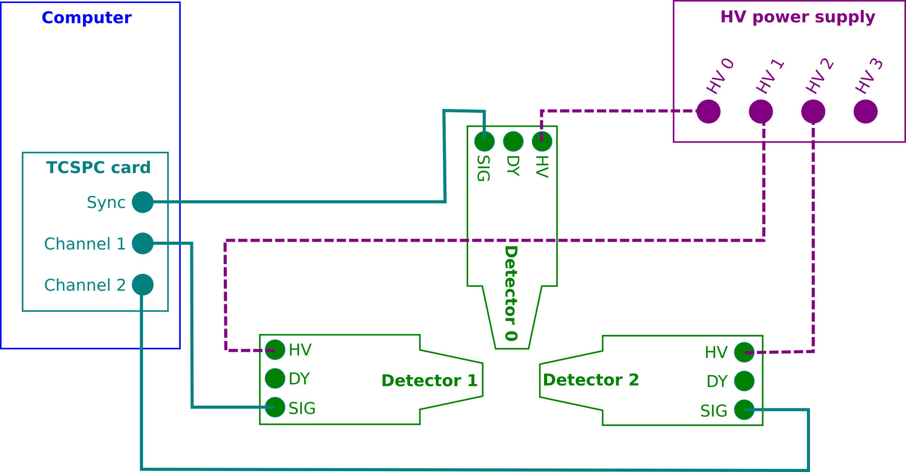

.. _hardware-sect:

#########
Hardware
#########

Pals3D has been developed to control a Positron Annihilation Lifetime Spectroscopy experimental device. During the development phase of the software, the instrumental system was composed of 3 different hardware components: plastic scintillator detectors, a high voltage power supply and a Time-Correlated Single Photon Counting (TCSPC) PCIe-card. These hardware components are discussed in more details in the following sections. Here is a schematic view of the measurement setup and connections.

PicoQuant TimeHarp 260 Pico
===========================

Device:
-------

The TCSPC card controlled by Pals3D is a `PicoQuant TimeHarp 260 <https://www.picoquant.com/products/category/tcspc-and-time-tagging-modules/timeharp-260-tcspc-and-mcs-board-with-pcie-interface>`_ TCSPC system (version PICO) with PCIe Interface. The reader is referred to the hardware corresponding User's Manual and Technical Data supplied with the hardware for its handling and installation instructions, and more detailed information.

The TimeHarp 260 consists in 3 independent timing inputs (Sync channel, channel 1 and channel 2). The time of arrival of each input signal is measured with a resolution of 25 ps by means of a Constant Fraction Discriminator (CFD) coupled with a Time to Digital Converter (TDC) on each input. Fast rise/fall time for input signal must be within the [1;10] ns time range and its amplitude should be within the [-100;-200] mV range to be optimal (full range is between 0 and -1.2 V). Maximum counting rates of 40 Million counts per second (Mcps) with a deadtime of 25 ns can be achieved.

Two operating modes are available:

* The first one is histogram mode, where only time differences between the Sync channel and channel 1 or 2 are recorded. In case of PALS application, this mode is only suitable for double coincidence measurements.
* The second is the **Time-Tagged Time-Resolved mode** (TTTR) which consists in recording all events directly to disk. The TH260 support two TTTR mode, i.e. T2 and T3. In T3 mode, the sync channel is dedicated to a periodic signal used for synchronization of the other channels, whereas in T2 mode, no distinction is made between the sync channel and others. All timing input will be recorded in list mode, i.e. recording a timestamp and the channel number of each event. For this mode the TimeHarp software only allows to save the data stream to disk, resulting in huge amount of unsorted raw data. Pals3D is also using the TTTR T2 mode, but in addition it implements the data processing on-the-fly and produces time difference histograms for each channel couples. 

.. note::
    Note that using the TTTR T2 mode is mandatory when considering triple coincidence experiments.

Settings
--------

Few settings are really mandatory to perform experiments using the TimeHarp 260 PCIe card, but for optimization purpose, we recommend that the CFD parameters and offsets are set as follows:

CFD parameters
^^^^^^^^^^^^^^

The CFD zero cross is of little influence for PALS measurements and can therefore be set as indicated in the user manual of the TH260 device. On the other hand the CFD levels should be optimized carefully to allow the distinction between the 1274 keV photon and the 511 keV photons (see :ref:`pals-in-brief-sect` for more details about the PALS technique).

.. Note::
    Unlike standard PALS instruments that use an energy gate for start and stop photons, the TimeHarp 260 device only allows for a lower threshold. This is partly compensated by requiring that the three photons are detected in a given time gate that can be adjusted.

.. _chn-offset-sect:

Channel offsets
^^^^^^^^^^^^^^^

For each TDC, an internal adjustable delay (called channel offset) can be set in order to finely tune the time difference between every channel. The channel offset should be set in order to time-align the different channels of the device. The time alignment can be performed using a :sup:`60`\ Co radioactive source.

* The channels 1 and 2 have to be aligned in such a way as to obtain a zero time difference in average.
* The channel 1/2 are set to be delayed by about 1 ns regarding to the sync channel. This first allows to ensure that events in the sync channel (detecting the start photon) should always be recorded earlier than any stop photon events occurring in the channel 1 and 2. This is of special importance for the triple coincidence sorter algorithm that assumes that the first event of a real triple event has to be in sync channel (see :ref:`triple-mode-sect`). The second advantage of setting a positive delay between sync and channels 1/2 is that it makes possible to record the full time spectrum of the positron annihilation lifetime, including the rising part of the time spectrum and some background.

.. Note::
    The value of 1 ns in not of importance, only that it should be a positive value and large enough to ensure that events in sync channel are recorded with lower timestamps than events in channel 1 and 2.

Software
--------

PicoQuant provides a dedicated software *TimeHarp* to operate the TimeHarp device and run standard experiments in histogram mode and TTTR mode T2 and T3. It is very useful to learn how to use the device as it is a plug and play instrument control. It can also be used as such for double coincidence PALS experiments, but only the T2 mode allows to do triple coincidence PALS experiments. Unfortunately, the TimeHarp software only allows for writing all raw events to an output file for T2 mode.

In case of short experiments the PicoQuant demo codes, provided in several programming languages, can be used to process those output files. The demo code is normally installed at the installation time. But they can also be found from `Github PicoQuant-Time-Tagged-File-Format-Demos repository <https://github.com/PicoQuant/PicoQuant-Time-Tagged-File-Format-Demos>`_.

As mentioned earlier, Pals3D allows to run both double and triple coincidence PALS experiments via the T2 mode and processes events on-the-fly. To achieve that Pals3D is built on top of the PicoQuant TH260Lib DLL, so in order to run Pals3D it is required to install the DLL (provided as a separate package by PicoQuant).

The TH260Lib DLL also comes with some demo code that is normally installed at the installation time. But they can also be found from `PicoQuant GitHub TH260Lib demos repository <https://github.com/PicoQuant/TH260-Demos>`_. 

.. Note:: 
    The Python demos used to build up the Pals3D software were at the time of development only available on Github.

Detection devices
=================

Three scintillation detectors built for ultra fast timing have been used for the experimental setup.

Devices
-------

Detectors designed for ultra fast timing are required to perform PALS measurements. Usually, plastic scintillators coupled with fast photomultiplier tubes are used, but other scintillator types may be used as well. Shape and size of the scintillators depend on the compromise between the detection solid angle, time resolution, and geometrical set-up requirements. For triple coincidence measurements, the two detectors dedicated to the 511 keV photons must be co-linear and should have a limited solid angle aperture.

Characteristics
---------------

Here are the characteristics of the detectors used in the device used to develop and test Pals3D:

Each detector consists of a 25 mm diameter, tapered to 19 mm over 25 mm high EJ-232 Q 0.5 % plastic scintillator. Mounted in aluminum housing, the scintillator is coupled to a fast Hamamatsu R2083 PMT with built-in Voltage Divider with separate anode and dynode outputs. They were supplied by `SCIONIX HOLLAND BV <https://scionix.nl/frame/>`_ under the model number 25/19A25/2M-E1-EJ232Q0.5 %-X-NEG.

Before plugging the detectors, it is necessary to verify that they produce the right output signal shape and amplitude when hit by gammas. To this aim, a radioactive source such as :sup:`60`\ Co or :sup:`22`\ Na is necessary. The signal coming from detectors is then measured by an oscilloscope. The output pulses must be negative, with a 100-200 mV amplitude (depends on the gamma energy) and with rising/falling time of about 5-10 ns long.

HV supply
=========

Device
------

The photomultiplier of a scintillator detector must be under high voltage to work properly. The HV nominal value is usually provided by the supplier of the detectors. Pals3D does not include any functionality to monitor the HV power supply which is then controlled by its own software. Therefore, any model having 3 independent and tunable channels should work. The device used to develop and test Pals3D was a `DT5533EN 4 channels Desktop HV Power Supply from CAEN <https://www.caen.it//subfamilies/up-to-6-kv-dt55xxe>`_. Please refer to the corresponding documentation for more details.

Software
--------

The HV power supply from CAEN comes with an instrument control software called GECO 2020 that is to be installed with administrator rights. The installation proceeds following the instructions provided by the vendor.

The connection to the device has to be configured to establish communication between the host computer and the power supply device. It requires settings of the COM port to initiate the communication protocol. The *Name* of the power supply can be tailored and the *Port Number* has to be chosen to be a free port of the host computer. The *Power Supply Type* and the *Connection type* as well as the *Baud rate*, *Data bits*, *Stop bits*, and *Parity bit* are set according to the supplier documentation.
