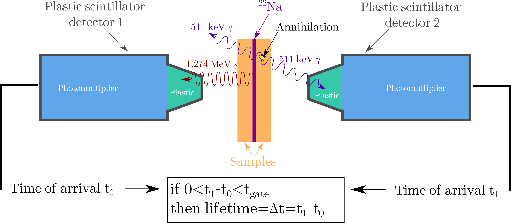
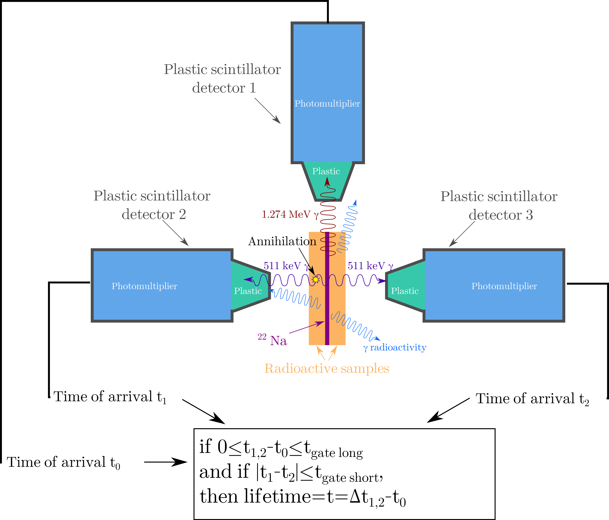

.. _pals-in-brief-sect:

#############
PALS in brief
#############

Standard double coincidence:
============================

Positron Annihilation Lifetime Spectroscopy (PALS) is a well-known method to probe the nature of vacancy type defects in a given material structure. Indeed the positron lifetime before its annihilation in a given material is directly linked to the presence and the nature of the defects. PALS is thus an experimental technique that aims at measuring as accurately as possible the positron lifetime inside materials. To measure the positron lifetime, one has to determine simultaneously the time of creation of the positron and the time of its annihilation with one of the surrounding electrons. To determine those times efficiently, it is very common to use scintillator detectors as they have a very fast time response to energy deposition. As a positron source, :sup:`22`\ Na isotope is commonly used and it is sandwiched in between two pieces of the material to study. Below, is a schematic view of the experimental setup.

The positron is emitted first, nearly at the same time as the 1.274 keV photon which gives the start time (or t\ :sub:`0`\ ). After some time, depending on the nature of the material and its defects, the positron will annihilate emitting two almost co-linear 511 keV photons. In case of standard double coincidence PALS measurements the detection of one of these 511 keV photons gives the stop time (or t\ :sub:`1`\ ). Accumulating a large number of events, one can then determine the average lifetime of the positron, and gather information about the defects.

PALS for radioactive materials:
===============================

For the case of studying radioactive materials, it is needed to require the detection of both 511 keV photons. Indeed, gamma-radioactivity is producing false coincidence events that could distort the collected spectra. Thus, standard double coincidence PALS experiments can be performed only for low-activity materials (activity below 100 kBq). To overcome such difficulties, one may artificially reduce the radioactive background by adding a third coincidence trigger within the acquisition system, by coupling three scintillator detectors instead of two to detect simultaneously the two 511 keV photons and the 1274 keV one. A schematic of PALS principle in triple coincidence mode is given in the figure below.

