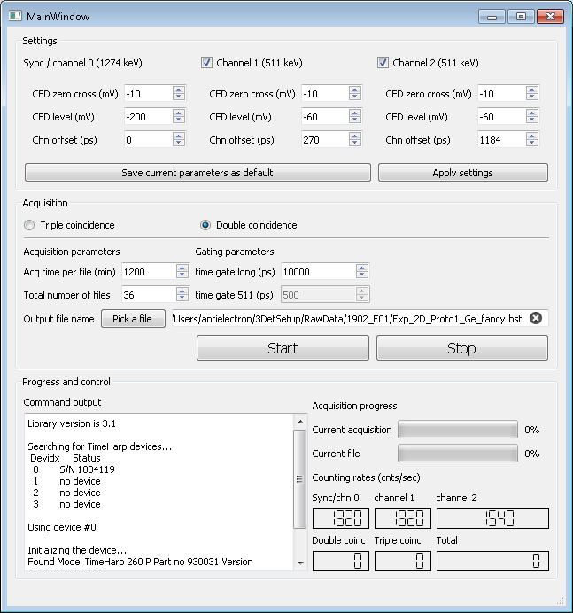

#########
Software
#########

Pals3D is a graphical application to control the device, perform measurements and sort the data for positron annihilation lifetime measurements using a TCSPC system TimeHarp 260 pico from PicoQuant.

When installed as instructed in the :ref:`install-sect` section the application is launched in a command prompt from the pals3D directory via the following command:

.. code-block:: bash

  $ python pals3D.py

The next section describes the content and usage of the graphical interface, and the following one will go deeper into details of the main software components for future developers to get an overview of the software philosophy.

.. _gui-sect:

Graphical interface
===================

The graphical interface has been designed using QtDesigner and PyQt5. Therefore any modifications to the interface should be done through QtDesigner and then exported to python using the :code:`pyuic5` command.

.. _set-panel-sect:

Settings panel
--------------

In this panel of the upper part of the GUI, the user set the device parameters, i.e.  the CFD parameters and the channel offsets.

The interface is configured so that it requires that the **Apply settings** button is clicked in order to actually apply the new settings. This is to avoid that the CFD parameters or offsets are changed during an on-going acquisition, which would render the results inconsistent (this should anyway not happen since the fields are disabled when a measurement is running). The **Apply settings** button, as well as the **Start** button, are disabled at application start because it requires time to initialize TH260 acquisition card and it can not be accessed during that time. Once the initialization process is complete, a message appears in the **Command output** and in the status bar, and the buttons are enabled.

A second button **Save current parameters as default** allows the user to save the current settings as default. Those values will then be reloaded at later start of the application. For this purpose it takes advantage of QSettings to store values as default for further use when restarting the application, so that when the settings are optimized there is no need to change those values anymore.

.. note::
   The tick boxes in the settings panel in front of Channel 1 (511 keV) and Channel 2 (511 keV) are currently without any effect on the acquisition. They are meant to allow the usage of only one of the two channels without rising warnings but this functionality is not yet implemented.

.. acq-panel-sect:

Acquisition panel
-----------------

This panel allows to select between the double and triple coincidence mode. For the double coincidence mode, only the *time gate long* is available as only one time gate is used in this mode (see :ref:`double-mode-sect`). When the **Triple coincidence** box is checked the *time gate 511* field is enabled and the time gate for the short gate can be added (see :ref:`triple-mode-sect`).

The details of the acquisition is also set in this panel. The user chooses an *acquisition time per file* value as well as a *total number of files* to be recorded. The application will then run the corresponding number of independent measurements of the given time.

The name of the output file is entered in the *Output file name* field either using the **Pick a file** button or manually. The default extension is *.hst* but at this point it does not matter since the filename entered here will be stripped from its extension if any and a *.hst* or *.npy* extension will be added automatically later on (together with the acquisition number). The name selected here should then be considered as a filename base that will be used as the common basis for all output files of the current acquisition.

The acquisition parameters will be saved as default through QSettings at each starting of a new measurement series. When later starting a new instance of the application the acquisition parameters will be loaded from the last measurement performed.

.. prog-panel-sect:

Progress and control panel
--------------------------

This part of the interface is meant for information to the user and as such allows no interaction.

**Command output**

    The left-hand part contains a command output text box where all messages are sent that come from the various commands used in the application. For example, information about the device is written here when the device is first initialized at application start.

    Each time the **Apply settings** button is clicked, the new parameters will be printed together with the new count rates obtained after applying the new settings.
    
**Acquisition progress**

    Two progress bars show the advancement of the current measurement. The *current acquisition* refers to the number of individual measurement completed so far relatively to the *total number of files*, while the *current file* bar refers to the on-going file itself.

    In addition, a more quantitative information can be found in the status bar, located at the bottom of the window, while the acquisition runs.

**Counting rates**

    Six numerical displays allow to follow diverse count rates. The three upper ones, labeled with the channel names are live estimation of the counting rates in each channels.
    
    The three lower ones labeled *double coinc*, *triple coinc* and *total* are only relevant during a measurement. They display the total number of events for one, and the number of coincidence events for the others, recorded so far for the whole measurement.

.. _soft-component-sect:

Software components
===================

Pals3D makes a great use of PyQt signal and slot mechanism to communicate between different threads and keep the GUI responsive. Three main thread components can be identified as follow:

* The **GUI main window** takes care of all the interaction between the user and the application.
* The **TH260 controller** deals with every instruction that actually interacts with the PicoQuant TH260 Pico acquisition card.
* The **TH260 sorter** is in charge of all the processing of the data stream coming from the TH260 card.

.. main-win-sect:

Main window application
-----------------------

Interface design
^^^^^^^^^^^^^^^^

The graphical user interface has been built using PyQt5 and uses signals and slots to implement the GUI logic. When possible the connecting slot by name convention has been used whenever possible. The software makes also extensive use of the *@PyQt.Slot()* decorator.

The GUI design has been done using Qt Designer and the :code:`pyuic5` command to generate the corresponding python script. It is then highly recommended to make further change to the interface design using the same way. Note also that any change made inside the .py script of the GUI design will be overwritten whenever the :code:`pyuic5` command is launched.

Threading
^^^^^^^^^
To keep the application responsive, threading is used in various ways. However, all kinds of threading make use of PyQt5 threading tools depending on the thread required:

*  The main thread runs the GUI application itself and is started when the application is launched
* A timer is used for fetching the counting rates when no measurement is running
* For short and punctual actions, such as initialization of the device, a threadpool and a pool of workers are used to allow the user to interact with the software while those operations are on-going
* One thread is dedicated to running the measurement itself and its worker is defined in the TH260controller class (see :ref:`th260-contr-sect`). It takes care of starting the acquisition, fetching counting rates and checking for warnings during the whole duration of a measurement. Data buffers generated by the card are then sent over a signal to an other thread dedicated to the data processing
* The data processing is entirely done in an other thread so that the sorting time would not impact the acquisition and reduces the risk of overrunning the FIFO buffer of the card. The raw data buffer is received from the controller thread and will take care of unpacking the data, and sorting and filtering the events. At the end of each individual measurement, relevant events are processed into a histogram and then saved to an output file. See the section :ref:`standard-output-sect` for the detail about output file formats.

.. controller-sect:

TH260 controller
----------------

As stated above, the TH260controller class takes care of all the interaction dealing with the acquisition card. It is built on top of the PicoQuant TH260Lib DLL which supplies all the necessary methods to control the device. The present version of the TH260controller is strongly based on the demo codes developed by PicoQuant available on GitHub `PicoQuant GitHub demos <https://github.com/PicoQuant/TH260-Demos>`_. 

.. note::
   Please note that the TH260Lib is not supplied as a part of the present software and must be ordered from PicoQuant directly.

The ctypes foreign function library for Python is used to allow calling functions of the C DLL supplied by PicoQuant.

The TH260 controller defines a number of signals that allow the smooth delivering of information to the end-user through the GUI. The TH260controller has been made inheriting from the QObject class in order to use the signals and slot logic. Whereas this has been mainly designed to be used jointly with a GUI, the signals can as well be caught by other slots. For example, the *printOutput(self, text)* method allows for console output of text messages, and similarly writing data buffers to file instead of sending it to the sorter worker can be done in a very simple way.

.. sorter-sect:

TH260 sorter
------------

We will not in this section discuss the way the sorting of the data stream is done, this is explained in the :ref:`features-sect` section, but we will discuss more technically how the task is performed.

The sorter worker receives the raw data buffer from the controller thread through a signal. It is received by the *sortBuffer()* method of the sorter class and the data stream is unpacked event by event following the data structure provided by the PicoQuant demo codes. The event is then handled depending of is type (real photon, overflow tag, markers). In standard PALS measurements only real photons and overflow events are expected so the case of marker events as been discarded. 

Instead of being written to files, as in the demo codes, the events are then filled into a deque of fixed length for later sorting. When the deque collection reaches its length limit, it is sorted in double/triple coincidence events and after that, only time differences between channels are kept into an array. A signal is at the same time emitted to update the display of the coincidence event numbers of the GUI.

At the end of an individual acquisition, the remaining events in the deque (if not full) are forced to the sorting algorithms to not loose any events. Then the whole time difference array is histogrammed and save to an output file. Before a new measurement is started, all relevant class attributes are reinitialized.

